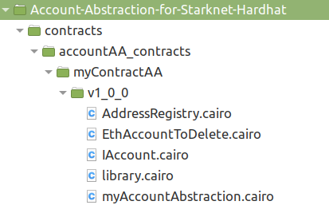

#  💰 Account abstraction with Hardhat v1.1.0 💰 
## extension of Hardhat starknet plugin

 This repo is showing a way to develop account abstraction in Starknet Network.  
 You can have more details about account abstraction in Starknet [here](https://github.com/starknet-edu/starknet-accounts) 

 Hardhat is a wonderful tool to test&debug Solidity smartcontracts for Ethereum. With the Starknet-hardhat plugin, you can also test Cairo smartcontracts for the Starknet network. By this way, you have the best tool to develop data exchange between L1-Ethereum and L2-Starknet.  
 Starknet has a fantastic feature : account abstraction. But unfortunately, Starknet-Hardhat isn't (yet) handling this subject ; it "just" manage OpenZeppelin 0.5.0 and Argent-X account contracts. You can't use the high level functions of the plugin in your own account contracts.  
 This repo proposes a solution to tests anyway your own account contracts, by the implementation of an extension to Starknet-Hardhat plugin. I confess 🛐 that it's dirty code, but it works.

⚠️Attention⚠️ : highly experimental code. Use at your own risks.


## 📦 Installation  📦
 Pull the Github project to your computer.  
 Use `cd Account-Abstraction-for-Starknet-Hardhat` to go to the root of the project.  
 Run `npm install` in this directory. 
 Activate your python venv.

 This project has been written with cairo v0.10.3, starknet-devnet v0.4.2, starknet-hardhat-plugin v0.6.8. 
 Due to fast iterations of Starknet and Cairo, they will probably be quickly out-of-date.

## Launch in devnet
 Open a console, and launch the devnet `starknet-devnet --seed 0`. It will launch a local Starknet network, and pre-deploy some accounts.
 >Note : by default, the test is in the local Devnet. You can also test in the Starknet Alpha Goerli testnet, by changing `network: "devnet"` to `network: "alpha"` in hardhat.config.ts (without launching starknet-devnet). Just be very patient 😴 with this network.


##  🚀 Start the test 🚀  🎆 ↘️  💩

 In the `scripts` directory, you have a script to test the extension.  
 Open a new console, and launch a Starknet venv environment (see [here](https://starknet.io/docs/quickstart.html))  
 Use `npx hardhat run scripts/testAA.ts`.  
 It will just deploy an account wallet, based on OZ wallet. You can customize the wallet contract, located in the `contracts` folder.  
## 🚧 Debug 🚧
 If you use VSCODE, this project is configured to be debugged.
### 🛠️ Debug .ts scripts 🛠️
 You have just to edit the .vscode/launch.json file.  
 In the `npx hardhat RUN starknet` item, change the .ts file name.  
 Put your breakpoints in the code (F9).  
 Press the play button (or F5).
### 🛠️ Debug your .cairo contract 🛠️
 If you work in the local starknet-devnet, you will see - in the terminal of devnet - the debug messages included in your .cairo file. For example, add in your contract code :

 ```python
 %{print("My bumpy variable = ",ids.myvar)%}
 ```
 and during execution, you will see the message in the testnet terminal.
## 🚧 To test & debug your own account wallet 🚧
 If you want to use this extension in your own Hardhat project :  
 Modify the hardhat.config.ts file ; it should start like this :

```typescript
import { HardhatUserConfig } from "hardhat/types";
import "@shardlabs/starknet-hardhat-plugin";  
import "./src/HHstarknetAbstractAccount";
```
 Copy the `src/HHstarknetAbstractAccount` directory and its content to your project.  

 You have to organize your cairo account contract like this : 
 
    
 **myContractAA** is the name of the type of this account contract.  
 **v1_0 _0** is the version of the contract.   
 Under, you can see your contract source files ; **myAccountAbstraction.cairo** is the "root" of these files.

 You can add a new tree in `accountAA_contracts`, with a different name for `myContractAA` ; you will have just to adapt in accordance your .ts code. The root file shall remain `myAccountAbstraction.cairo`. Today, the version shall not be modified.  
 The current code of the extension uses standard Starknet hash,keys and signatures. If you plan to work on a wallet account that experiment exotic choices for these topics, you will have to dig in the `accountAA.ts` file, and change the code to your needs.

 See the scripts/testAA.ts code to have an example of code implementation.  
 In your own test scripts, you have to add at the beginning :
```typescript
import { AAccount } from "hardhat";
```  

 Then you have access to the following functions :
### 📖 deployAccountAA :
**Deploy a new wallet account**  
 Usage :  
 ```typescript
 const Account = await AAccount.deployAccountAA("myContractAA",{});
 ```
 If your wallet constructor is the OZ one, just put `,{}` after the name of your type of wallet.
 If you have customized your constructor, add your additional parameters in the brackets. Ex :
  ```typescript
 const Account = await AAccount.deployAccountAA("myContractAA",{par1:"name",par2:1});
 ```
### 📖 getAccountAAfromAddress :
 **Deploy an existing wallet account**  
 Usage :  
 ```typescript
 const Account = await AAccount.getAccountAAfromAddress(WalletAddress, privateKey, "myContractAA");
 ```

### Account object :
The resulting Account Object has the same methods than a standard wallet :  
- invoke  (single & multi)
- call  (single & multi)
- declare  (Fees mandatory on Starknet Alpha testnet)
- estimateFee  (not yet available for 'declare' function)
- .address  
- .privatekey  
and you don't have to manage hash & signatures in your tests code.  
You can find some example of usage in one of my projects [here](https://github.com/PhilippeR26/AskYourParents-contracts/tree/main/scripts) (currently in progress).
 
## 📜 license
MIT license.

## 🙏 Inspiration
The Accounts and ERC20 contracts used in this repo are made by [OpenZeppelin](https://github.com/OpenZeppelin/cairo-contracts), OZ contracts version 0.5.0.  
The wallet account is a modified OpenZeppelin contract.  
The plugin is starknet-hardhat-plugin@0.6.8 ([Shard-Labs](https://github.com/Shard-Labs/starknet-hardhat-plugin#cli-commands)).  
The Hardhat tool is hardhat@2.12.1 ([Hardhat](https://github.com/NomicFoundation/hardhat))
